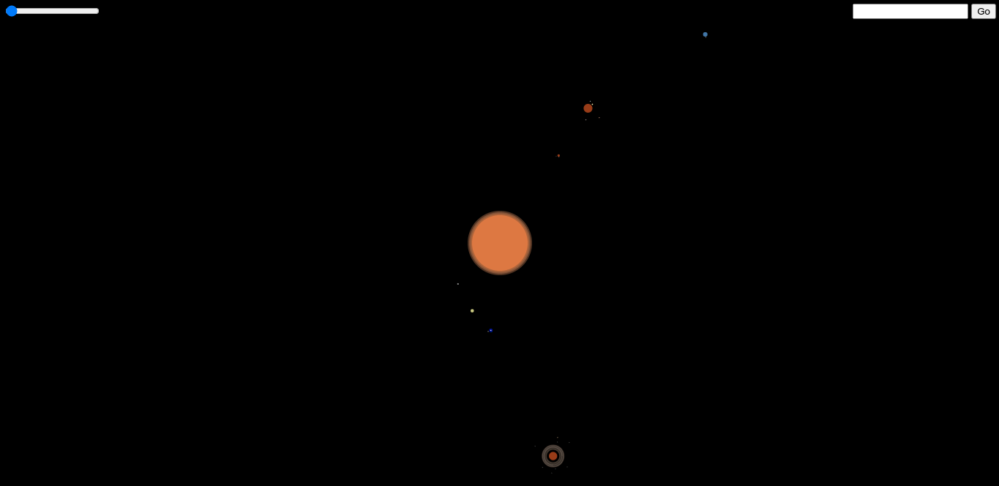

# Planetarium

This is a small project made with the javascript's library "ZDog", it was made in less than a week but it still lacks all the Earth's continents.

### Controls
Click and drag the mouse to rotate the camera and use the mouse wheel to increment or decrement zoom.
Zoom can also be adjusted with the top left scroller.

There is a search function on the top right corner, in wich the user has to correctly write the name of a body of the Solar System in english and press the "Go" button, this will set the desired body as the center of view of the camera.
